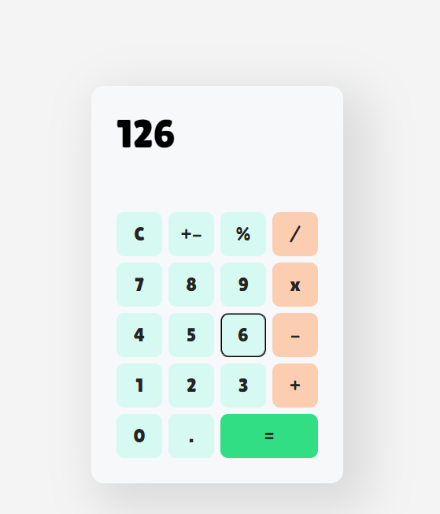

# <h1 align="center">Calculator - React</h1>
<h3 align="center">This React project is a functional and user-friendly calculator designed to provide a convenient and interactive way to perform basic arithmetic operations.</h3>

    

